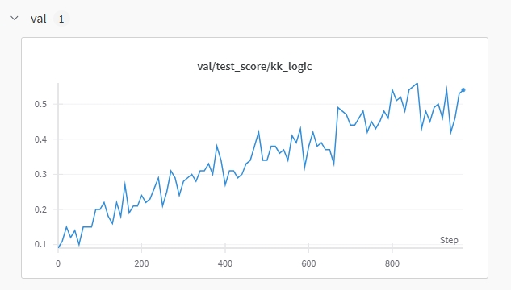

# Logic Rl

## 🎉 **Successfully reproduced DeepSeek R1 Zero on 2K Logic Puzzle Dataset.**

## 📢 **Our detailed technical report is coming soon! Stay tuned!** 

See project explanation : [here](https://evxpwrsfkdb.feishu.cn/docx/NokEdaMBmo6aqZxVdxkcSm2cnab?from=from_copylink).

Wandb project : [here](https://wandb.ai/ustc_ai/GRPO_logic_KK/reports/GRPO-Zero--VmlldzoxMTIwOTYyNw?accessToken=gnbnl5mu5pwfww7gtwxymohg85w7d7vthvjvbl4w8yxg0a99vf1k22m11e61cvv8).

---


## Enhanced Features (After Rule-Based RL)

| 🚩 Uncertainty Marking | 📝 Progressive Summarization | ✅ Self Verification | 🌐 Multilingual Switching |
|------------------------|-----------------------------|---------------------|--------------------------|
| Flag ambiguous steps for verification | Maintain intermediate conclusions | First verify then answer | Chinese reasoning traces with English answers |


---

## 📸 Results Preview

<table>
  <tr>
    <td align="center"></td>
    <td align="center"></td>
  </tr>
  <tr>
    <td align="center">Test Score Plot</td>
    <td align="center">Average Output Length Plot</td>
  </tr>
</table>
<table>
  <tr>
    <td align="center"></td>
  </tr>
  <tr>
    <td align="center">Model Output Example</td>
  </tr>
</table>

---

## Benchmark

| Model                                                             | 2ppl | 3ppl | 4ppl | 5ppl | 6ppl | 7ppl | 8ppl |
|------------------------------------------------------------------------|------|------|------|------|------|------|------|
| o1-2024-12-17               | 0.83 | 0.51 | 0.38 | 0.38 | 0.35 | 0.30 | 0.20 |
| GPT-4o                      | 0.68 | 0.57 | 0.49 | 0.32 | 0.23 | 0.21 | 0.11 |
| Deepseek-Math-7b            | 0.35 | 0.21 | 0.08 | 0.06 | 0.02 | 0.00 | 0.00 |
| Qwen2.5-7B-Instruct-1M      | 0.49 | 0.40 | 0.25 | 0.11 | 0.02 | 0.06 | 0.01 |
| Qwen2.5-7B-Logic-RL (ours)  | 0.83 | 0.88 | 0.87 | 0.84 | 0.71 | 0.67 | 0.65 |

Our model only used 2K training data with 400 training steps. More model benchmarks will be updated later this week.

---

## 🛠️ Installation

```bash
conda create -n logic python=3.9
pip install torch==2.4.0 --index-url https://download.pytorch.org/whl/cu121
pip3 install vllm==0.6.3 ray
pip3 install flash-attn --no-build-isolation
pip install -e .  # For verl integration
pip install wandb IPython matplotlib
```

---

## Data Preparation

You can directly use /data.

For your own data generation, here's a demo:

### Base Model
```bash
python ./examples/data_preprocess/kk.py \
    --local_dir {processed_data_path} \
    --data_path {raw_data_path}
```

### Instruct Model
```bash
python ./examples/data_preprocess/kk.py \
    --template_type=qwen-instruct \
    --local_dir {processed_data_path} \
    --data_path {raw_data_path}
```

---

## Training Execution
```bash
conda activate logic
bash main_grpo.sh  # 4×A100 80G
```

---

## ⚙️ Implementation Details

| Component              | Location                          |
|------------------------|-----------------------------------|
| Reward Modeling     | `verl/utils/reward_score/kk.py`   |
| Data Preprocessing   | `examples/data_preprocess/kk.py`  |

---


## Citation
```
@misc{logic-rl,
author       = {Tian Xie and Qingnan Ren and Yuqian Hong and Zitian Gao and Haoming Luo},
title        = {Logic-RL},
howpublished = {https://github.com/Unakar/Logic-RL},
note         = {Accessed: 2025-02-03},
year         = {2025}
}
```

---

## Acknowledgements
- [Verl](https://github.com/volcengine/verl) 🔗
- [TinyZero](https://github.com/Jiayi-Pan/TinyZero) 🔗
- [Knights and Knaves (K&K) puzzles dataset](https://github.com/AlphaPav/mem-kk-logic) 🔗

---

## Star History

[](https://star-history.com/#Unakar/Logic-RL&Date)
